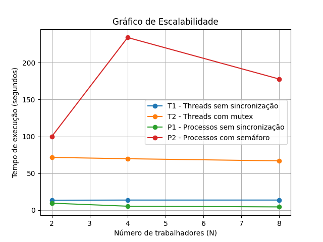

# Trabalho Sistemas Operacionais – O Duelo de Contextos
## Processos vs Threads

## 👥 Integrantes
- **Luana Thurow**

---

## 🖥️ Assinatura do Hardware

- **Processador:** Intel Core i5‑2400 @ 3.10 GHz  
- **Núcleos físicos:** 4  
- **Threads por núcleo:** 1 (sem Hyper‑Threading)  
- **Total de CPUs lógicas:** 4  
- **Arquitetura:** x86_64  
- **Cache:**  
  - L1: 128 KB (4 instâncias)  
  - L2: 1 MB (4 instâncias)  
  - L3: 6 MB (compartilhado)

---

## ⏱️ Tabela de Tempos de Execução

**Tempo real de execução (`time`) e valor final do contador**

| Cenário | N | Tempo real (s) | Contador final |
|--------|---|---------------|----------------|
| T1 – Threads sem sincronização | 2 | 13,464 | 396.542.585 |
| T1 – Threads sem sincronização | 4 | 13,665 | 252.536.212 |
| T1 – Threads sem sincronização | 8 | 13,674 | 137.373.732 |
| T2 – Threads com mutex | 2 | 71,511 | 1.000.000.000 |
| T2 – Threads com mutex | 4 | 69,704 | 1.000.000.000 |
| T2 – Threads com mutex | 8 | 66,794 | 1.000.000.000 |
| P1 – Processos sem sincronização | 2 | 9,440 | 395.069.544 |
| P1 – Processos sem sincronização | 4 | 5,324 | 336.300.976 |
| P1 – Processos sem sincronização | 8 | 4,363 | 180.260.407 |
| P2 – Processos com semáforo | 2 | 99,784 | 1.000.000.000 |
| P2 – Processos com semáforo | 4 | 234,073 | 1.000.000.000 |
| P2 – Processos com semáforo | 8 | 177,713 | 1.000.000.000 |

---

## ⚠️ Análise de Corrupção

Nos experimentos **T1** (threads sem sincronização) e **P1** (processos sem sincronização), o contador não atingiu o valor esperado de **1.000.000.000** devido à ocorrência de **condições de corrida**. A operação de incremento (`contador++`) não é atômica, pois envolve leitura, modificação e escrita da variável na memória. Quando múltiplas threads ou processos executam essa operação simultaneamente, incrementos são perdidos, resultando em valores finais incorretos.

O hardware utilizado possui **4 núcleos físicos**, permitindo execução paralela real, o que aumenta o grau de concorrência no acesso ao contador compartilhado. Além disso, a hierarquia de cache (L1 e L2 privados por núcleo e L3 compartilhado) contribui para inconsistências temporárias entre os núcleos. Os valores próximos, porém diferentes, entre T1 e P1 reforçam o caráter **não determinístico** do problema, que depende do escalonamento do sistema operacional e das características do hardware.

---

## 📈 Gráfico de Escalabilidade

O gráfico a seguir apresenta o **tempo de execução em função do número de trabalhadores (N)** para cada cenário analisado:

---

## 📊 Conclusão

Os resultados demonstram que **threads apresentam menor overhead de criação** e comunicação mais eficiente quando comparadas a processos. Por outro lado, **processos possuem maior isolamento**, porém com custo elevado de criação e comunicação, principalmente quando utilizam memória compartilhada e semáforos.

Os experimentos sem sincronização (T1 e P1) apresentam melhor desempenho, porém resultados incorretos devido à corrupção dos dados. Já os experimentos com sincronização (T2 e P2) garantem consistência, mas com significativo impacto no desempenho, evidenciando a importância do uso adequado de mecanismos de sincronização e a influência do modelo de concorrência na escalabilidade.